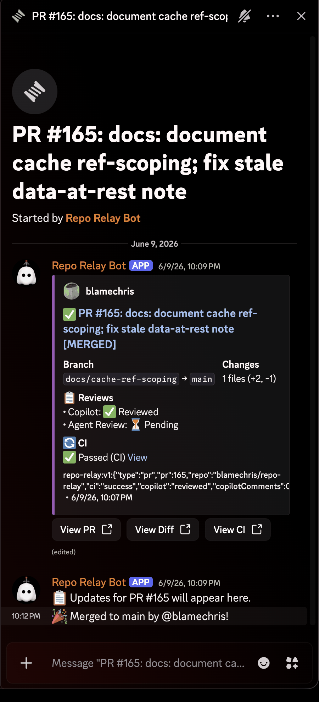

# Repo Relay

**Discord bot that gives every pull request one live discussion thread — CI, reviews, and releases in context, not notification spam.**

[](https://github.com/blamechris/repo-relay/actions/workflows/ci.yml)
[](LICENSE)
[](https://github.com/blamechris/repo-relay/tags)



*A real PR thread from Repo Relay's own server ([PR #165](https://github.com/blamechris/repo-relay/pull/165)): one embed, updated in place through CI and review to its merged state, with updates landing in the attached thread instead of the channel.*

## Why Repo Relay

GitHub's built-in Discord webhook posts a new channel message for every event, so one active PR scatters pushes, CI runs, and reviews across the feed. Repo Relay keeps each PR to exactly one channel message:

- **One embed per PR, updated in place** — CI status, review status, and the merged/closed state edit the original embed instead of adding messages.
- **One thread per PR** — pushes, CI results, reviews, and the merge post to the PR's attached thread, so updates stay next to their context.
- **The channel stays scannable** — it reads as a list of PRs, not a log of events.
- **No server to run** — ships as a GitHub Action; state lives in SQLite on the runner (or in `actions/cache` on hosted runners).

## Quick Start

The fastest way to get started:

```bash
npx blamechris/repo-relay init
```

The interactive wizard asks what you want to relay (issues, releases, deployments, security alerts, review polling), guides you through the Discord bot setup, and writes the workflow file for you.

<details>
<summary><strong>Manual Setup</strong></summary>

### 1. Create Discord Bot

1. Go to [Discord Developer Portal](https://discord.com/developers/applications)
2. Create new application → Bot → Reset Token → Copy token
3. No privileged intents are required — leave **Message Content** and **Server Members** intents disabled
4. Generate invite URL (OAuth2 → URL Generator):
   - Scopes: `bot`
   - Permissions: See [Required Discord Permissions](#required-discord-permissions) below
5. Invite bot to your server

### 2. Get Channel IDs

1. Enable Developer Mode in Discord (Settings → Advanced → Developer Mode)
2. Right-click channels → Copy ID

### 3. Add Secrets to Repository

Add these secrets to your GitHub repository (Settings → Secrets and variables → Actions):

| Secret | Required | Description |
|--------|----------|-------------|
| `DISCORD_BOT_TOKEN` | Yes | Bot token from step 1 |
| `DISCORD_CHANNEL_PRS` | Yes | Channel ID for PR notifications |
| `DISCORD_CHANNEL_ISSUES` | No | Channel ID for issue notifications |
| `DISCORD_CHANNEL_RELEASES` | No | Channel ID for release notifications |
| `DISCORD_CHANNEL_DEPLOYMENTS` | No | Channel ID for deployment notifications |
| `DISCORD_CHANNEL_SECURITY` | No | Channel ID for security alerts |

### 4. Add Workflow

Create `.github/workflows/discord-notify.yml`:

```yaml
name: Discord Notifications

on:
  pull_request:
    types: [opened, synchronize, closed, reopened, edited, ready_for_review, converted_to_draft]
  pull_request_review:
    types: [submitted]
  issue_comment:
    types: [created]
  issues:
    types: [opened, closed]
  release:
    types: [published]
  workflow_run:
    workflows: ["CI"]  # Name of your CI workflow
    types: [completed]
  # Optional — add these if you relay deployments and security alerts:
  # deployment_status:
  # dependabot_alert:
  #   types: [created]
  # secret_scanning_alert:
  #   types: [created]
  # code_scanning_alert:
  #   types: [created, appeared_in_branch]

jobs:
  notify:
    runs-on: self-hosted  # or ubuntu-latest (see State Storage below)
    permissions:
      pull-requests: read
      issues: read
      contents: read
    # Skip workflow_run events without PRs
    if: github.event_name != 'workflow_run' || github.event.workflow_run.pull_requests[0] != null

    steps:
      - uses: blamechris/repo-relay@v1
        with:
          discord_bot_token: ${{ secrets.DISCORD_BOT_TOKEN }}
          channel_prs: ${{ secrets.DISCORD_CHANNEL_PRS }}
          channel_issues: ${{ secrets.DISCORD_CHANNEL_ISSUES }}
          channel_releases: ${{ secrets.DISCORD_CHANNEL_RELEASES }}
          channel_deployments: ${{ secrets.DISCORD_CHANNEL_DEPLOYMENTS }}
          channel_security: ${{ secrets.DISCORD_CHANNEL_SECURITY }}
```

That's it! The action handles Node.js setup, dependency installation, and execution automatically. A full copy-paste example lives at [`examples/workflow.yml`](examples/workflow.yml).

</details>

## Features

- **PR Notifications** - Creates a Discord embed per PR with a thread for updates
- **Threaded Updates** - All updates (pushes, CI, reviews, merge) go to the PR's thread
- **CI Status** - Shows workflow status (pending, running, passed, failed)
- **Review Detection** - Detects Copilot and agent-review via piggyback on push/CI events; human `approved`/`changes_requested` reviews post to the thread and update the embed
- **Issue & Release Notifications** - Separate channels for different event types
- **Deployment Notifications** - `deployment_status` events post an embed (environment, ref, deployer) for terminal states: success, failure, error
- **Security Alerts** - Newly created Dependabot, secret scanning, and code scanning alerts post to a dedicated channel
- **Default-Branch Push Notifications** - Direct pushes to the default branch (PR merge commits are skipped); force pushes get a distinct embed
- **Persistent State** - SQLite tracks PR ↔ message mappings
- **Stale Message Handling** - Gracefully recovers if Discord messages are deleted

## Channel Routing

Every event type routes to a channel input; the optional ones fall back to `channel_prs` when unset, so a single channel works out of the box.

| Input | Routes | Fallback |
|-------|--------|----------|
| `channel_prs` | PR embeds and threads, CI status, reviews, comments, default-branch pushes | Required |
| `channel_issues` | Issue notifications (opened, closed, reopened) | `channel_prs` |
| `channel_releases` | Release published notifications | `channel_prs` |
| `channel_deployments` | Deployment success/failure/error embeds | `channel_prs` |
| `channel_security` | Dependabot, secret scanning, and code scanning alert embeds | `channel_prs` |

### Action Inputs

| Input | Required | Default | Description |
|-------|----------|---------|-------------|
| `discord_bot_token` | Yes | - | Discord bot token |
| `channel_prs` | Yes | - | Channel ID for PR notifications |
| `channel_issues` | No | `channel_prs` | Channel ID for issue notifications |
| `channel_releases` | No | `channel_prs` | Channel ID for release notifications |
| `channel_deployments` | No | `channel_prs` | Channel ID for deployment notifications |
| `channel_security` | No | `channel_prs` | Channel ID for security alert notifications |
| `state_dir` | No | `~/.repo-relay` | Directory for SQLite state |
| `github_token` | No | `github.token` | GitHub token for API access |
| `best_effort` | No | `false` | Exit 0 with a warning on transient infra failures (Discord 5xx, timeouts); config errors (bad token, missing channel/permissions) still fail |

## How It Works

### Message Flow

When a PR is opened, repo-relay creates an embed with a thread attached:

```
┌─────────────────────────────────────────────┐
│ 🔀 PR #123: Add combat animations           │
│                                             │
│ Author: @username                           │
│ Branch: feat/combat-animations → main       │
│ Changes: 12 files (+450, -120)              │
│                                             │
│ 📋 Reviews                                  │
│ • Copilot: ⏳ Pending                       │
│ • Agent Review: ⏳ Pending                  │
│                                             │
│ 🔄 CI: ⏳ Pending                           │
└─────────────────────────────────────────────┘
   └── Thread: "PR #123: Add combat animations"
       ├── 📋 Updates for PR #123 will appear here.
       ├── 📤 Push: 1 commit by @username
       ├── 🔄 CI: ✅ Passed (CI)
       ├── 🤖 Copilot: Reviewed
       └── 🎉 Merged by @username
```

### Review Detection (Piggyback Approach)

GitHub Apps using `GITHUB_TOKEN` don't trigger workflows. To work around this:

- When any PR event fires (push, CI completion), the bot checks GitHub API for reviews
- If Copilot or agent-review is detected, the embed and thread are updated
- Reviews are detected on the **next** event, not immediately

<details>
<summary><strong>Advanced: Manual Workflow Setup</strong></summary>

If you need more control (custom Node.js version, additional steps, etc.), you can set up the workflow manually:

```yaml
name: Discord Notifications

on:
  pull_request:
    types: [opened, synchronize, closed, reopened, edited, ready_for_review, converted_to_draft]
  pull_request_review:
    types: [submitted]
  issue_comment:
    types: [created]
  issues:
    types: [opened, closed]
  release:
    types: [published]
  workflow_run:
    workflows: ["CI"]
    types: [completed]

jobs:
  notify:
    runs-on: self-hosted
    permissions:
      pull-requests: read
      issues: read
      contents: read
    if: github.event_name != 'workflow_run' || github.event.workflow_run.pull_requests[0] != null

    steps:
      - name: Checkout repo-relay
        uses: actions/checkout@v4
        with:
          repository: blamechris/repo-relay
          ref: v1
          path: .repo-relay

      - name: Setup Node.js
        uses: actions/setup-node@v4
        with:
          node-version: '20'
          cache: 'npm'
          cache-dependency-path: .repo-relay/package-lock.json

      - name: Install dependencies
        working-directory: .repo-relay
        run: npm ci --omit=dev

      - name: Run repo-relay
        working-directory: .repo-relay
        env:
          DISCORD_BOT_TOKEN: ${{ secrets.DISCORD_BOT_TOKEN }}
          DISCORD_CHANNEL_PRS: ${{ secrets.DISCORD_CHANNEL_PRS }}
          DISCORD_CHANNEL_ISSUES: ${{ secrets.DISCORD_CHANNEL_ISSUES }}
          DISCORD_CHANNEL_RELEASES: ${{ secrets.DISCORD_CHANNEL_RELEASES }}
          DISCORD_CHANNEL_DEPLOYMENTS: ${{ secrets.DISCORD_CHANNEL_DEPLOYMENTS }}
          DISCORD_CHANNEL_SECURITY: ${{ secrets.DISCORD_CHANNEL_SECURITY }}
          GITHUB_TOKEN: ${{ github.token }}
          STATE_DIR: ~/.repo-relay
        run: node dist/cli.js

      - name: Cleanup
        if: always()
        run: rm -rf .repo-relay
```

</details>

## Required Discord Permissions

When generating the bot invite URL, ensure these permissions are enabled:

| Permission | Why It's Needed |
|------------|-----------------|
| **Send Messages** | Post PR/issue/release embeds |
| **Create Public Threads** | Create threads for PR updates |
| **Send Messages in Threads** | Post updates to PR threads |
| **Manage Threads** | Unarchive auto-archived PR threads when new updates arrive |
| **Embed Links** | Render rich embeds with PR info |
| **Read Message History** | Find existing PR messages to update |

**Invite URL scopes:** `bot`

If the bot connects but can't post, check the channel-level permissions. The bot needs these permissions in each channel it posts to.

## Self-Hosted vs GitHub-Hosted Runners

| Aspect | Self-Hosted | GitHub-Hosted |
|--------|-------------|---------------|
| **State Persistence** | ✅ SQLite persists in `~/.repo-relay/` | ⚠️ Requires `actions/cache` |
| **Setup** | Requires runner installation | Zero setup |
| **Cost** | Your hardware | GitHub Actions minutes |
| **Speed** | Fast (no cold start) | ~30s cold start |
| **Availability** | Depends on your uptime | Always available |
| **Queue Blocking** | Can block behind long CI jobs | Isolated from other workflows |

**Recommendation:**
- **Self-hosted** if you have existing runners and want persistent PR tracking
- **GitHub-hosted** (`ubuntu-latest`) with `actions/cache` for state persistence (see below)

### State Persistence with GitHub-Hosted Runners

Add an `actions/cache` step before repo-relay to persist state between runs. The `key` **must be unique per run** — GitHub cache entries are immutable, so a constant key saves once on the first run and never updates again, silently freezing your state. Use a per-run key with a `restore-keys` prefix so each run restores the most recent snapshot and saves a new one:

```yaml
name: Discord Notifications

on:
  # ... your event triggers ...

# Workflow-level key (NOT inside jobs/steps) — serializes repo-relay runs
concurrency:
  group: repo-relay-${{ github.repository }}

jobs:
  notify:
    runs-on: ubuntu-latest
    steps:
      - uses: actions/cache@v4
        with:
          path: ~/.repo-relay
          key: repo-relay-state-${{ github.repository }}-${{ github.run_id }}
          restore-keys: |
            repo-relay-state-${{ github.repository }}-

      - uses: blamechris/repo-relay@v1
        with:
          # ... your inputs ...
```

**Notes:**
- The `concurrency` group serializes repo-relay runs — without it, simultaneous events (e.g. a push and its CI completing) can race and create duplicate embeds or lose status updates
- Cache evicts after 7 days of inactivity (fine for active repos)
- **Caches are ref-scoped**: runs on a PR's merge ref see that PR's saves plus the default branch's, but not other PRs'. In practice the chatty sequences (pushes, reviews, comments on one PR) share the PR's scope, and default-branch events (issues, releases, `workflow_run`) share the default scope — state written in one scope reaches the other only via channel-search recovery
- The cached DB stores Discord message IDs plus PR/issue metadata (titles, bodies, branch names). For private repos this means repo content sits in the Actions cache at rest; if that matters for your threat model, skip the cache (the bot falls back to channel search)
- If cache misses, repo-relay falls back to searching the last 100 channel messages

## State Storage

| Runner Type | Storage Location | Persistence |
|-------------|------------------|-------------|
| **Self-hosted** (recommended) | `~/.repo-relay/{repo-name}/state.db` | Permanent |
| **GitHub-hosted** | `actions/cache` | Persistent with cache (see [State Persistence](#state-persistence-with-github-hosted-runners)) |

## Troubleshooting

### "Missing Access" Error

**Symptom:** Bot connects but fails to send messages with "Missing Access" error.

**Fix:** The bot lacks permissions in the target channel. Check:
1. Bot has the [required permissions](#required-discord-permissions) at the server level
2. Channel-specific permissions don't override/block the bot
3. The channel ID is correct (right-click channel → Copy ID with Developer Mode enabled)

### Notification Cascades (Too Many Messages)

**Symptom:** Replying to Copilot review comments triggers more notifications.

**Fix:** Handled automatically on both personal and org-owned repos — the bot drops `pull_request_review` events where the review state is `commented` and the reviewer's `author_association` is `OWNER`, `MEMBER`, or `COLLABORATOR` (the events GitHub fires when someone with write access replies to review comments). No workflow-level `if` filter is needed. Human `approved`/`changes_requested` reviews are never filtered — they post to the PR thread and update the embed. See [#13](https://github.com/blamechris/repo-relay/issues/13) and [#146](https://github.com/blamechris/repo-relay/issues/146).

### First PR Shows Red X

**Symptom:** First PR fails before secrets are configured.

**Fix:** This is expected - configure the secrets, then re-run the failed workflow. Future PRs will work.

### Job Queued Behind Long CI

**Symptom:** Discord notification waits in queue while long-running CI jobs complete.

**Fix:**
- Use `ubuntu-latest` instead of self-hosted runner (isolates from other jobs)
- Or configure runner labels to separate notification jobs from build jobs

## Known Limitations

1. **Review events don't trigger immediately** - GitHub Apps using `GITHUB_TOKEN` don't trigger workflows. Reviews are detected on the next push or CI event via the piggyback approach.

2. **GitHub-hosted runners lose state** - GitHub-hosted runners don't persist state between runs. Use `actions/cache` to persist the `~/.repo-relay` directory (see [State Persistence](#state-persistence-with-github-hosted-runners)).

## Development

```bash
# Install dependencies
npm install

# Build TypeScript
npm run build

# Run locally (requires environment variables)
npm run dev
```

---

**Contributing:** Bug reports and pull requests are welcome via [GitHub Issues](https://github.com/blamechris/repo-relay/issues).
**Security:** See [SECURITY.md](SECURITY.md) for how to report vulnerabilities.
**License:** MIT — see [LICENSE](LICENSE).
